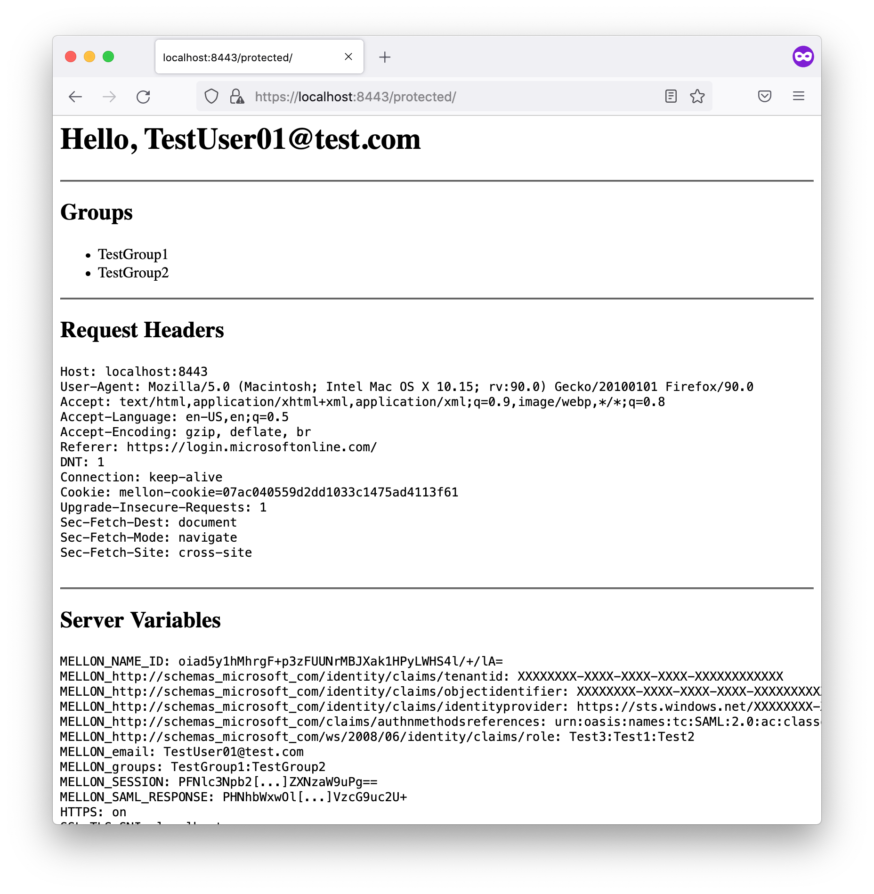

# mod_auth_mellon_dockerized

This project aims to provide, for educational purposes, a simple Docker image configuration, with a minimal configuration of *mod_auth_mellon*, an authentication module for Apache webservers that serves as a SAML 2.0 Service Provider (SP).

Provided here, are a Dockerfile, a mellon configuration template, and some convenience scripts to help get things up and running as easily as possible (the scripts assume that you are running Docker on Linux/Mac OS).

## Getting Started
- Decide on a SAML 2.0 Entity ID for the Service Provider that will be represented by your Docker container, and modify the `MellonSPentityId` line `mellon.conf` to reflect this value.
- Run `./create_signing_cert_and_key.sh` to create public and private keys that will be used for the purposes of digitally signing outbound SAML messages that will be sent to the Identity Provider (IdP). Note that this script depends on `openssl`. Alternatively you can provide your own key-pair, in which case, the public and private keys will need to be stored in seperate, PEM-encoded files, without any password protection, and should be named `signing-cert.crt` and `signing-cert.key` for the public and private keys, respectively.
- Run `./build_docker_image.sh` to create the Docker image
- Run `./run_docker_image.sh` to start a Docker container using the newly created image. If all goes well, the container will be listing on port https://localhost:8443.
- Generate and download the container's SP SAML 2.0 Metadata by sending a request to https://localhost:8443/protected/saml/metadata.
- Configure the IdP using the generated metadata, and to send the user identifier in a SAML attribute named `email`.
- Download, or otherwise obtain, from the IdP, the IdP SAML 2.0 Metadata, and put this in place of `idp-metadata.xml`.
- At this point, all of the configuration should be complete. You may or may not need to restart the container in order for it to pickup the IdP metadata. To do this, just stop the container (using ctrl-c in the container's console, which should still be in the foreground, via the `docker kill <container-id>` command, etc.), and then re-run `./run_docker_image.sh`

## Testing SSO
- Point your browser at https://localhost:8443/protected/
- Assuming that you have not already authenticated, this will result in a redirect to the IdP for authentication.
- Once the IdP has successfully authenticated you, it will generate a SAML Assertion and redirect the browser back to your SP's appropriate endpoint, depending on the SAML binding in use.
- Your SP will receive and process the SAML Assertion, and upon success, will forward you on to the originally requested URL (https://localhost:8443/protected/).
- By default, this Docker image has a simple `index.php` page that should display something similar to the following.
  - Your SP is expecting the IdP to respond with an email attribute that mod_auth_mellon has been configured to use as the user identifier.
  - If a SAML attribute named `groups` was configured at, and sent by, the IdP, the contents of that attribute will be enumerated
  - The output will also render the HTTP request headers as received from the browser and as set by mod_auth_mellon prior to passing the requent on to `index.php`, as well as the server-side variables.

